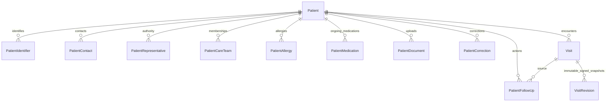

# Patient records: schema and behavior

Implemented 2026-10-08 across backend/frontend. Fresh-schema design; no migrations created/applied. [Plan](patient-record-expansion-plan.md); [verification](patient-record-verification.md).

## Identity and ownership

| Patient fields | Meaning |
| --- | --- |
| `id`, permanent `patient_number` | Internal key and immutable, unique `P-…` file number; distinguish people with the same identifier |
| Names, nullable `dob_year`, optional gender | Year-only birth precision; unknown remains unknown, displayed age is approximate |
| `national_id` | Compatibility primary identifier; structured register supports additional identifiers |
| `identity_verification`, server actor/time | `unknown` / `reported` / `verified`; only authorized doctor/admin can assert verification |
| Marital status, occupation, address, phone | Controlled marital choices; optional text stored as `""`, optional dates/references as `NULL` |
| `registration_date` | Clinic registration, not hospital admission; `admission_date` remains a compatibility alias |
| Language, contact channel, communication restrictions | Contact preferences; restrictions are recorded/displayed, not an automatic message-delivery policy engine |
| `allergy_status`, `medication_status` | `unknown` / `none_known` / `recorded`; empty registers never establish a confirmed negative |
| Family history, important notes | Ongoing patient information; visit findings remain encounter-level |
| `version`, archive metadata, `merged_into` | Optimistic concurrency, retained archive, optional duplicate reconciliation |

First name/surname remain required; birth year/gender/ID/phone may be unknown. Recommended completeness is independent from validity: configurable `patient_completeness_fields` in clinic settings (birth year/gender/registration by default; ID, phone, team, language available). Missing recommendations never block saving.

Care-team membership owns assignment/access. Legacy `doctor` is compatibility display/create input only, restricted to an actual doctor; no administrator-as-doctor fallback or access grant from that field. Nonadmin creators join the current team; administrators may select team members without becoming a treating clinician. Existing historical-author/creator scope is preserved alongside current membership; ending membership does not revoke independent historical scope.

## Related records

Each mutable longitudinal record has patient, creator/updater/timestamps, active/retired state, retirement actor/time/reason. Retirement retains history; edits require a reason and produce immutable before/after corrections.

| Model | Main fields / rules |
| --- | --- |
| `PatientIdentifier` | Type national ID/passport/other; canonical value, issuer, optional uppercase two-letter issuing country; verification + server actor/time. Active identity unique within one patient/type/value/issuer/country; duplicates across people allowed |
| `PatientContact` | Name, relationship, phone/email, emergency/primary flags, notes; multiple contacts, at most one active primary |
| `PatientRepresentative` | Separate person/contact details, relationship, authority scope (contact/records/decisions/both), evidence, verification, validity dates; recorded authority does not itself grant application login/access |
| `PatientAllergy` | Substance/reaction/severity, suspected/confirmed/refuted/resolved/error status; source/details/visit, recorded date, notes |
| `PatientMedication` | Ongoing drug/dosage/schedule; active/on-hold/stopped/error status, start/end, source/details/visit, recorded date, notes; separate from encounter prescriptions |
| `PatientCareTeam` | Controlled role doctor/nurse/therapist/assistant/coordinator, start/end, assigner/remover/reason; one current membership per user/patient, ended rows retained, rejoining creates a row |
| `PatientFollowUp` | Title, optional current-team owner, due date, pending/completed/missed/cancelled/waived status, outcome reason/server completion actor/time; optional source visit/appointment/completed visit |
| `PatientDocument` | Upload/checksum/MIME/uploader, category/description, document date, source, author/provider, verification/server actor/time; versioned metadata |
| `PatientCorrection` | Immutable actor/time/reason and relevant before/after values for profile and longitudinal-record changes |
| `PatientDuplicateReview` | Ordered patient pair, dismiss/review-later or different-person decision, reviewer/reason/time; reviewed matches can be shown again |
| `PatientMerge` | Immutable source, surviving patient, actor/reason/time, original record IDs, demographic/team snapshots, reconciliation adjustments |

Linked clinical records/appointments must belong to the same patient. New follow-up owners must be current active team members; historical owners remain visible. Terminal action outcomes cannot be reopened: create a new action. Existing visit follow-up dates/results have one synchronized bridge action; edit those dates/results from the visit. Additional actions are independent, and dashboard/reports count actions without double-counting the bridge.

Allergies/medications copy positive evidence to `recorded`; retiring/stopping entries does not silently assert `none_known`. Explicit negative summaries require clinical-edit permission and cannot contradict active positive entries. Verification is invalidated or must be reasserted when identifying/provenance facts change; editing unrelated fields preserves it.

## Encounter facts and signing

`level_of_care` describes setting; `care_basis` separately describes unknown/voluntary/involuntary. Existing settings remain available for describing external care, without adding admission workflows. Firearm access and diagnosis/plan discussion are tri-state: unknown is `NULL`, distinct from `false`.

Signing creates schema-version-2 immutable revisions containing patient identity/file number plus current longitudinal allergies/medications and summary states. Later profile/register changes do not rewrite signed facts or issued PDFs. Current exports label longitudinal information separately from encounter information; issued documents remain their original signed artifacts.

## Duplicates and optional merging

Identifiers stay unchanged: no `*`/`-1` suffixes on official IDs. Active and archived matches warn without blocking creation; permanent file numbers distinguish them while an absent person's identity cannot be confirmed. Warnings/reviews are dismissible; no compulsory merge step. Duplicate discovery remains scoped to permitted records.

Admin with patient-edit/archive permissions explicitly previews source→active survivor, reviews transfer counts/access warning, supplies reason and confirms. Preview expires after 10 minutes and binds actor, both versions, source record inventory/content and team. A stale or changed preview fails safely. Source may already be archived.

Visits, appointments, invoices, documents and longitudinal records move to survivor; survivor demographics remain unchanged. Current active team access combines explicitly. Identical active identifiers transfer retired, conflicting source primary contacts become nonprimary; adjustments are recorded. Source archives and links to survivor; restoring a merged source is blocked. Signed revisions/issued bytes stay unchanged. Merge is intentionally not an automatic or reversible button: recovery requires a deliberate recovery process.

## API and concurrency

Base: `/api/v1/patients/{id}/`. Shared session/CSRF/envelopes and permissions remain authoritative. Profile updates require opening patient version and `correction_reason` for important demographic changes.

| Endpoint | Contract |
| --- | --- |
| `records/?kind=…&offset=0` GET | Kinds identifiers/contacts/representatives/allergies/medications/follow-ups; `{items,total,version}`, 100/page, includes retired history |
| `records/` POST | `{kind,record_id?,operation:"save"|"retire",fields,reason,version}` → `{record,version}`; use opening **patient** version |
| `corrections/?offset=0` GET | `{items,total,merges}`, 100 corrections/page plus latest 100 merge events; includes retained merged-source corrections; clinical corrections require clinical-view permission |
| `duplicate_review/` POST | `{other_id,status:"dismissed"|"different",reason,version}` |
| `merge_preview/` POST | Source URL + `{target_id}` → token/source version/target version/counts |
| `merge/` POST | Source URL + `{token,reason,version,target_version}` → survivor |
| `team_candidates/` GET | Minimal eligible active users for assignment; permission checked |
| Existing care-team/document endpoints | Team writes use patient version/removal reason; document writes use opening document version |

Unknown fields/invalid links/choices/dates are rejected. Parent locking serializes longitudinal writes; versions advance after mutations. Visit writes lock patient before visit, consistent with merge; batch overdue review locks parents in stable order. PostgreSQL concurrency still needs runtime verification. Generic record/merge operations use versions/stale-preview rejection; do not assume replay support beyond existing idempotency-covered endpoints.

## Retention by record type

| Action/type | Retained behavior |
| --- | --- |
| Patient archive | Profile, clinical history, team history, documents and actions retained; ordinary active lists exclude archived patients |
| Longitudinal retirement / team removal | Retained inactive row, actor/date/reason, correction or membership history |
| Demographic correction | Current profile changes; immutable before/after/reason/actor retained; signed history unchanged |
| Document removal | Soft archive metadata; referenced upload bytes retained, not physical erasure |
| Draft visit removal | Soft archive; bridge follow-up retired; finalized clinical history cannot be removed this way |
| Signed revisions / issued prescription/referral | Immutable snapshot and issued artifacts retained; current identity never silently replaces historical identity |
| Pseudonymization | Clears mutable identity and retires mutable identifying registers; immutable corrections, merge manifests and signed identities may still identify the person; **not complete erasure** |
| Optional merge | Source and merge event retained; original ownership inventory/adjustments retained; records transferred, signed snapshots preserved |
| Full authenticated ZIP recovery | Includes managed new models and media; bound preview/confirmation, replacement scope; catalog merge remains separate |

No new automatic patient-record purge or retention duration was introduced. Backup cleanup and explicit orphan-media reconciliation retain their separate policies. Follow clinic policy before erasure/recovery operations; this implementation does not choose a legal retention period.
